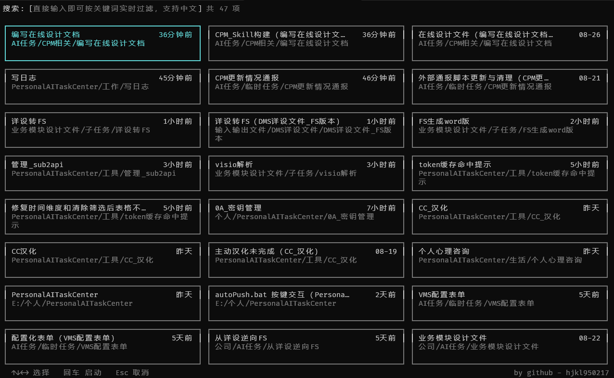
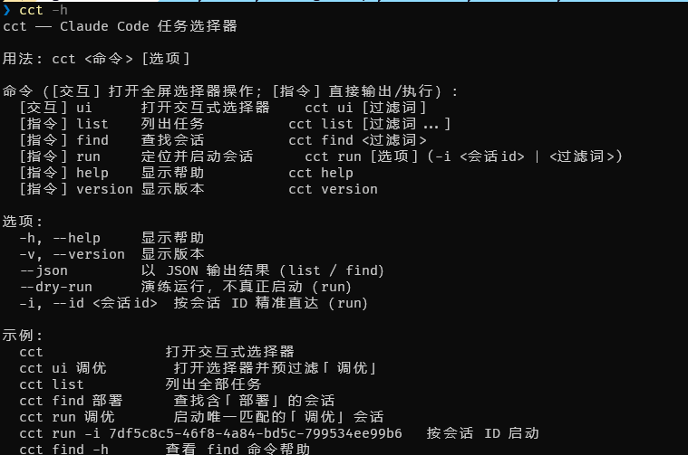

# cct — Claude Code Task

[](LICENSE)
[](https://github.com/hjkl950217/ClaudeCodeTask)
[](https://github.com/PowerShell/PowerShell)
[](https://dotnet.microsoft.com/)
[](https://learn.microsoft.com/dotnet/csharp/)
[](https://pester.dev)
[](https://github.com/hjkl950217/ClaudeCodeTask)
[](https://github.com/hjkl950217/ClaudeCodeTask)
[](https://www.powershellgallery.com/packages/ClaudeCodeTask)

Claude Code 任务文件夹选择器：一条命令列出所有 [Claude Code](https://claude.ai/code) 任务文件夹/会话，选中自动 `cd` 并启动 `claude`。

*Claude Code task folder selector: one command lists all Claude Code task folders/sessions; select one to `cd` into it and launch `claude`.*

> 主要测试平台：Windows（Windows 11 / PowerShell 7.6）。其他平台理论上可运行，但未系统验证。

> *Primary test platform: Windows (Windows 11 / PowerShell 7.6). Other platforms should work in theory but are not systematically verified.*

## 效果预览

*Preview*





## 功能

*Features*

- 全屏卡片网格选择器，键盘导航、实时搜索过滤

  *Full-screen card-grid selector with keyboard navigation and real-time search filtering.*
- 自动聚合同一任务目录的会话：手动命名项优先，AI 自动标题保底

  *Auto-groups sessions under the same task folder: manually named items win, AI-generated titles as fallback.*
- 支持会话中途 `cd` 到子目录，列表按存储目录分组，恢复目标指向子目录

  *Sessions may `cd` into subdirectories; the list groups by storage directory and resume targets the subdirectory.*
- 退出 claude 后终端留在任务目录

  *The terminal stays in the task folder after exiting claude.*
- 增量缓存：热启动扫描加速约 65-73%

  *Incremental cache: warm-start scanning is about 65-73% faster.*
- `cct clear` 清理：无参清 cct 扫描缓存（下次扫描全量重建）；`-cc` 按行数判定清理多余 Claude Code 会话（每目录保留最新 ≥ 阈值会话，先预览过滤规则与待删清单，确认后删除）

  *`cct clear` cleanup: a bare call clears the cct scan cache (fully rebuilt on the next scan); `-cc` removes surplus Claude Code sessions by line-count threshold (keeps the newest ones ≥ threshold per folder, previews the filter rules and the delete list, then deletes after confirmation).*

## 技术亮点

*Tech highlights*

- **预编译 C# 内核（ClaudeCodeTask.Core）**：性能关键路径由 C# 内核 dll 承担（`CctScannerV5` 并行读盘 + 增量缓存），PowerShell 只做类型转换，扫描提速约 24 倍

  *Pre-compiled C# kernel (ClaudeCodeTask.Core): performance-critical paths run in the C# dll (`CctScannerV5` parallel disk scan + incremental cache), PowerShell only does type conversion — about 24x faster scanning.*
- **并行扫描**：C# `Parallel.For` 并发读盘，无共享状态，单文件异常不中断整体

  *Parallel scan: C# `Parallel.For` reads the disk concurrently with no shared state; a single file error never aborts the whole run.*
- **增量缓存**：文件数 ≥ 20 且缓存存在时，按 mtime+size 复用精确结果，热启动快约 65-73%

  *Incremental cache: with at least 20 files and an existing cache, exact results are reused by mtime+size — about 65-73% faster warm start.*
- **纯 .NET 目录判定**：`Directory.Exists` 替代 `Test-Path`，免 PowerShell 提供程序开销

  *Pure .NET directory checks: `Directory.Exists` instead of `Test-Path` avoids PowerShell provider overhead.*
- **行 diff 重绘**：选择器仅重绘变化行，覆盖式写入不清行，无闪烁

  *Line-diff redraw: the selector only redraws changed lines with overwrite writes and no line clearing — flicker-free.*

## 安装

*Installation*

### 前置条件

*Prerequisites*

- [PowerShell 7.6+](https://github.com/PowerShell/PowerShell)
- [Claude Code](https://claude.ai/code)
- [Pester 6](https://pester.dev)（仅开发测试需要）

  *Required for development testing only.*

### 方式一：从 PowerShell Gallery 安装（推荐）

*Option 1: install from the PowerShell Gallery (recommended)*

```powershell
# 安装模块（命令为 cct）
# Install the module (the command is cct)
Install-Module -Name ClaudeCodeTask -Scope CurrentUser
```

- 安装后命令为 **`cct`**（模块名 `ClaudeCodeTask`、命令 `cct`），重开终端即可使用

  *The command is **`cct`** (module `ClaudeCodeTask`, command `cct`); reopen the terminal to use it.*
- **无需手动导入**：PowerShell 会在你首次输入 `cct` 时自动从 `$env:PSModulePath` 找到并加载模块，不需要 `Import-Module`

  ***No manual import needed**: PowerShell auto-loads the module from `$env:PSModulePath` the first time you type `cct` — no `Import-Module` required.*

**更新模块**

*Update*

```powershell
# 更新到最新版
# Update to the latest version
Update-Module -Name ClaudeCodeTask

# 若上一命令因权限报错，显式指定用户级作用域重试
# If the command above fails on permissions, retry with an explicit user scope
Update-Module -Name ClaudeCodeTask -Scope CurrentUser -Force
```

- 更新前先确认当前版本：`Get-Module -Name ClaudeCodeTask -ListAvailable`

  *Check the current version first: `Get-Module -Name ClaudeCodeTask -ListAvailable`.*
- 若模块已在本会话加载，更新后需**重开终端**（或先 `Remove-Module ClaudeCodeTask` 再重新输入 `cct`）才会生效

  *If the module is already loaded in the session, **reopen the terminal** after updating (or `Remove-Module ClaudeCodeTask` and type `cct` again).*

**卸载模块**

*Uninstall*

```powershell
Uninstall-Module -Name ClaudeCodeTask
```

### 方式二：从代码仓库安装（体验源码 / 开发调试）

*Option 2: install from the source repository (try the code / development)*

```powershell
git clone https://github.com/hjkl950217/ClaudeCodeTask.git
cd ClaudeCodeTask

# 将模块加载追加到 PowerShell profile
# Append the module load to your PowerShell profile
Add-Content -LiteralPath $PROFILE -Value "`nImport-Module `"$PWD\ClaudeCodeTask.UI\ClaudeCodeTask.psm1`""
```

重开终端即生效。改代码后重开终端加载新版。

*Reopen the terminal to apply. Reopen again after code changes to load the new version.*

### 中国大陆网络访问说明

*Access from mainland China*

`Install-Module` 默认从官方源 `https://www.powershellgallery.com/api/v2` 拉取，**无需额外添加或切换源**。该端点**没有官方中国镜像**，在大陆跨网环境下可能偶发连接超时或 DNS 解析失败（与本仓库无关，任何 PSGallery 模块都会遇到）。

*`Install-Module` pulls from the official feed `https://www.powershellgallery.com/api/v2` by default — **no extra source to add or switch**. That endpoint has **no official China mirror**, so cross-network timeouts or DNS failures can happen from the mainland (unrelated to this repo; every PSGallery module hits this).*

若遇到超时 / 无法解析，按以下顺序处理：

*If you hit timeouts / resolution failures, try in this order:*

**1. 配置代理**（推荐，最通用）

*1. Configure a proxy (recommended, most universal)*

PowerShell 的 NuGet 提供程序遵循系统代理设置，设置后即可正常访问：

*PowerShell's NuGet provider follows the system proxy settings:*

```powershell
# 临时设置（当前终端生效）
# Temporary settings (current terminal only)
$env:HTTP_PROXY  = 'http://127.0.0.1:7890'
$env:HTTPS_PROXY = 'http://127.0.0.1:7890'

# 或用系统「设置 → 网络和 Internet → 代理」开启代理后重开终端
# Or enable the proxy in System Settings → Network & Internet → Proxy, then reopen the terminal
Install-Module -Name ClaudeCodeTask -Scope CurrentUser
```

> **有代理软件（Clash / v2rayN 等）的用户**：无需全局代理，直接在代理软件的「分流规则」里把 `powershellgallery.com` 加入走代理即可。这样只代理这一个域名，其余流量不受影响；地址 `api/v2` 与网页同域名，只加主域 `powershellgallery.com` 即覆盖安装请求。

> *With proxy software (Clash / v2rayN etc.): no global proxy needed — just add `powershellgallery.com` to the software's routing rules. Only that domain goes through the proxy; `api/v2` shares the domain with the website, so the main domain alone covers install requests.*

**2. 离线安装**（无代理时的兜底）

*2. Offline install (fallback when no proxy)*

从 [PowerShell Gallery 页面](https://www.powershellgallery.com/packages/ClaudeCodeTask) 手动下载 `.nupkg` 文件，然后：

*Download the `.nupkg` from the [PowerShell Gallery page](https://www.powershellgallery.com/packages/ClaudeCodeTask) manually, then:*

```powershell
# 下载 ClaudeCodeTask.0.1.0.nupkg 到当前目录后执行（版本号以 PSGallery 页面最新版为准）：
# Download ClaudeCodeTask.0.1.0.nupkg to the current directory, then run (use the latest version on the PSGallery page):
Install-Module -Name .\ClaudeCodeTask.0.1.0.nupkg -SkipPublisherCheck -Force
```

安装后同样以 `cct` 命令使用。

*Use the `cct` command afterwards, same as above.*

## 使用

*Usage*

```powershell
# 弹出任务列表，空白输入 = 全部
# Show the task list; blank input = all
cct

# 带初始过滤词
# With an initial filter keyword
cct <关键词>

# 清理 cct 扫描缓存（cache.json），下次扫描全量重建
# Clear the cct scan cache (cache.json); fully rebuilt on the next scan
cct clear

# 清理多余 Claude Code 会话（先预览过滤规则与待删清单，确认后删除）
# Clean up surplus Claude Code sessions (previews the filter rules and the delete list; deletes after confirmation)
cct clear -cc
```

`cct clear` 选项：

*`cct clear` options:*

| 选项 | 说明 |
|------|------|
| `-cc` | 清理多余会话（不与清缓存同用；用此参数时不动 cct 缓存） |
| `-y, --yes` | 跳过交互确认直接删除（非交互环境不加 --yes 时只预览不删） |
| `--keep <数>` | 每目录保留的最新会话个数（默认 1） |
| `--min <行数>` | 会话有效行数阈值，「对话次数」按 .jsonl 行数近似（默认 20） |
| `--dry-run` | 只打印预览，不删除 |

选择器操作：

*Selector controls:*

| 操作 | 效果 |
|------|------|
| ↑↓←→ | 上下左右移动 |
| Enter | 确认选择 |
| Esc | 取消退出 |
| 输入文字 | 实时过滤（中文需输入法提交后过滤） |
| Backspace | 删除上一个过滤字符 |

## 配置

*Configuration*

以下配置在首次运行时**自动生成**到 `~/.cct/config.json`，**无需手动创建**；需要自定义时再编辑该文件，改后重启终端生效：

*The config is **auto-generated** to `~/.cct/config.json` on first run — **no manual creation needed**; edit the file to customize, then restart the terminal.*

```json
{
  "launchCommand":      "claude -c",
  "resumeCommand":      "claude --resume {sessionId}",
  "excludePathPatterns":[".claude/worktrees/", "AppData\\Local\\Temp"],
  "maxVisibleRows":     0,
  "minUserMessages":    10,
  "includeFolderFind":  0
}
```

| 字段 | 默认 | 说明 |
|------|------|------|
| `launchCommand` | `claude -c` | 文件夹项启动命令 |
| `resumeCommand` | `claude --resume {sessionId}` | 会话项恢复命令，`{sessionId}` 自动替换 |
| `excludePathPatterns` | worktrees + Temp | 排除路径模式 |
| `maxVisibleRows` | 0 (自适应) | 卡片网格最大行数 |
| `minUserMessages` | 10 | 会话显示阈值（≥ 此条数才显示） |
| `includeFolderFind` | 0 (仅会话) | 0 = 只列出会话（默认）；1 = 额外列出没有任何会话的目录（同目录已有会话时不重复列出） |

> **关于 `--dangerously-skip-permissions`**：默认启动命令**不带**该参数。它会跳过 [Claude Code](https://claude.ai/code) 的所有权限确认（工具调用、文件写入、命令执行等直接放行），有安全风险。除非你明确需要完全无人值守，否则不要添加。

> *About `--dangerously-skip-permissions`: the default launch command does **not** include it. It skips all Claude Code permission prompts (tool calls, file writes, command execution all pass through) and is a security risk. Don't add it unless you truly need fully unattended runs.*

## 数据来源

*Data source*

只读 `~/.claude/projects/` 目录下的会话历史文件（`.jsonl`），按首现工作目录自动分组，零配置。

*Reads session history files (`.jsonl`) under `~/.claude/projects/` only, auto-grouped by first-seen working directory — zero config.*

## 开发

*Development*

### 手动加载本地运行（临时终端，不改 profile）

*Manual local run (temporary terminal, no profile changes)*

```powershell
# 从仓库检出目录直接加载模块并启动选择器（无需安装）
# Load the module straight from the checkout and start the selector (no install needed)
Import-Module "$PWD\ClaudeCodeTask.UI\ClaudeCodeTask.psm1" -Force
cct

# 改过 UI 代码后重新加载再试（-Force 强制重连）
# Reload after UI code changes (-Force forces a reconnect)
Import-Module "$PWD\ClaudeCodeTask.UI\ClaudeCodeTask.psm1" -Force
cct
```

- `-Force` 覆盖已加载的旧版本模块，改代码后不必重开终端

  *`-Force` replaces the loaded old module — no terminal restart needed after code changes.*
- UI 层为 PowerShell 源码，改动即时生效；**内核层（`ClaudeCodeTask.Core/*.cs`）是预编译 dll**，改 C# 后需先跑 `ClaudeCodeTask.Core\build.ps1` 重新编译（且因 `Add-Type` 类型缓存约束，换类体必须换类名，如 V2→V3→V4），再重新加载模块

  *The UI layer is PowerShell source, effective immediately; the **kernel (`ClaudeCodeTask.Core/*.cs`) is a pre-compiled dll** — run `ClaudeCodeTask.Core\build.ps1` to rebuild after C# changes (and due to `Add-Type` type caching, a changed class body needs a renamed class, e.g. V2→V3→V4), then reload the module.*
- 手动运行占用当前终端（全屏），退出后回到原 shell

  *Manual run takes over the current terminal (full-screen); the original shell is restored after exit.*

### 跑测试（Pester 6）

*Run tests (Pester 6)*

```powershell
pwsh -NoProfile -Command "Import-Module Pester -MinimumVersion 5.0.0; Invoke-Pester -Path 'tests' -Output Minimal"

# 单文件测试（界面层最常改）
# Single-file test (the UI layer changes most often)
pwsh -NoProfile -Command "Import-Module Pester -MinimumVersion 5.0.0; Invoke-Pester -Path 'tests\Selector.Tests.ps1' -Output Detailed"
```

- 测试覆盖：15 个测试文件，225 个测试用例

  *Coverage: 15 test files, 225 test cases.*
- 涵盖：数据提取、聚合、搜索、选择器渲染、配置、启动执行、缓存、清理（clear）

  *Covers: data extraction, aggregation, search, selector rendering, config, launching, cache, cleanup (clear).*

### 项目结构

*Project structure*

```
├── .github/           # GitHub 集成（CI 测试 + PSGallery 发布工作流 + issue 模板）
│   └── workflows/     ci.yml（push/PR 跑 Pester）+ publish.yml（release 发布到 PSGallery）
├── ClaudeCodeTask.Core/ # C# 内核（预编译 dll，改动内核后跑该目录 build.ps1 重新编译）
│   ├── CctScannerV5.cs        并行读盘扫描 + 增量缓存 + 会话血缘提取
│   ├── CctSpinner.cs          加载动画
│   ├── CctConsoleMode.cs      控制台模式（TTY 保持）
│   ├── build.ps1              内核编译脚本（产物 lib/ClaudeCodeTask.Core.dll）
│   ├── ClaudeCodeTask.Core.csproj   net8.0（PowerShell 7.6 可直接加载）
│   └── lib/ClaudeCodeTask.Core.dll   编译产物（随仓库提交）
├── ClaudeCodeTask.UI/ # UI 外壳（模块名 = 包名 = ClaudeCodeTask，命令 = cct）
│   ├── Data.ps1           数据层（调用 Core dll，并行 + 增量缓存）
│   ├── Selector.ps1       界面层（全屏卡片网格，行 diff 重绘）
│   ├── Launcher.ps1       执行层（启动/恢复 claude）
│   ├── Clear.ps1          清理层（cct clear：清缓存 / 清理多余会话）
│   ├── Cct.ps1            主入口
│   ├── Config.ps1         配置读写
│   ├── Display.ps1        显示工具（中文/emoji 宽度按 East Asian Width 判定）
│   ├── Spinner.ps1        加载动画
│   ├── ClaudeCodeTask.psd1  模块清单
│   └── ClaudeCodeTask.psm1  模块声明（导出 cct 命令）
├── tests/           # Pester 测试（15 文件）
│   └── fixtures/     测试夹具（fake-claude.ps1 等）
├── 经验和文档/       # 长期保存的排查复盘、决策记录（随仓库推送）
│   └── 性能调试/      性能探针复盘（claude 接管时序）
└── README.md
```

## 友情链接

*Links*

- [Claude Code](https://github.com/anthropics/claude-code) —— Anthropic 官方命令行工具

  *Anthropic's official CLI.*
- [LINUX DO](https://linux.do) —— 新的理想型技术社区

  *A new ideal tech community.*

## 许可

*License*

本项目以 [MIT](LICENSE) 许可发布。

*This project is released under the [MIT](LICENSE) license.*
